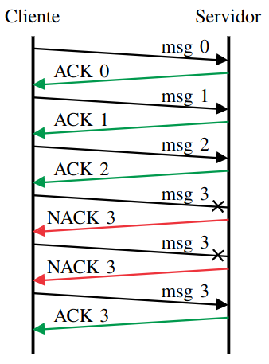
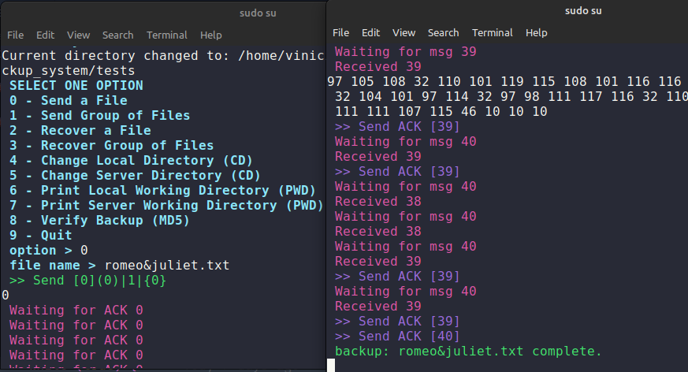

# File Backup System 

## About
The project consists of a **file backup system** developed using C++ in a UNIX environment. The system utilizes **RawSockets** for communication between a Client and a Server, requiring an *Ethernet* cable connection between the machines. Another option for testing is to use the computer's *loopback* interface if only one machine is available.

## Messages

All messages sent and received by both machines are instances of the class `Message`. For sending, the `Controller` is responsible for receiving all the information from the message and copying it to the sending buffer. On the other hand, during reception, the channel data will be assigned to an object of the class **Message**. For reading and writing, all files are treated as binary files. The messages attributes are:

| Attribute          | Value        |
|--------------------|--------------|
| Ethernet Header    | 14 bytes     |
| Init Markerk       | 01111110     |
| Data Size          | 6 bits       |
| Sequence           | 6 bits       |
| Type               | 4 bits       |
| Data               | 0 a 63 bytes |
| Parity (Data)      | 1 byte       |


## Protocol

The communication uses the "Stop and Wait" protocol, in which the sender sends a data packet and waits for the receiver's confirmation before sending the next packet. This ensures the integrity of the transmission by allowing the retransmission of lost or corrupted packets.



## Instructions

To compile the project, run the following command in the root directory:

```bash
make
```

If you want to compile the project with debug information, use:

```bash
make debug
```

### Server & Client

To run the **Server** and the **Client** you need to run the following commands in the root directory with **sudo** option:

```bash
./server
```

```bash
./client
```

### Network Interface

In both `client.cpp` and `server.cpp` the interface is set to `eno1`. You must change it to the interface you are using. To check the available interfaces, run the following command:

```bash
ifconfig
```

If you want to use the *loopback* interface, change the interface to `lo`.



## Backup Verification

To verify the backup, the system provides the **MD5** option to check the integrity of the files. Other options are available, such as the `diff` command, which compares the files byte by byte.
